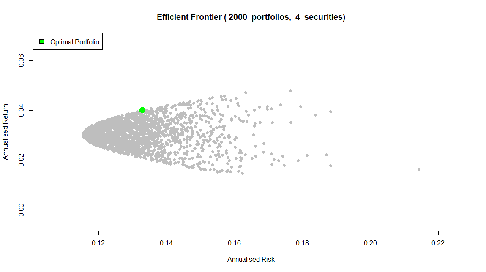
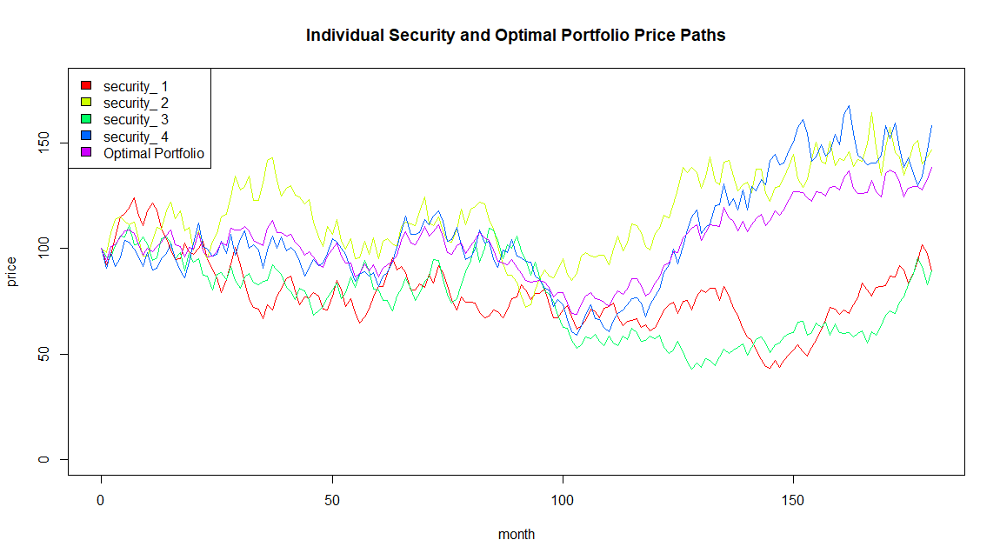

# Multi Asset Efficient Frontier

Example in R of how to create a scaleable Efficient Frontier (Markowitz Model) from any number of assets.  This example uses random series for the asset returns but this could easily be substituted for real data and also considers a long-only portfolio with no short-selling  The first chart shows the efficient frontier together with the 'Optimal Portfolio' which has the highest Information Ratio (return / risk).

The second chart shows the price paths of the assets models together with that of the Optimal Portfolio.   

